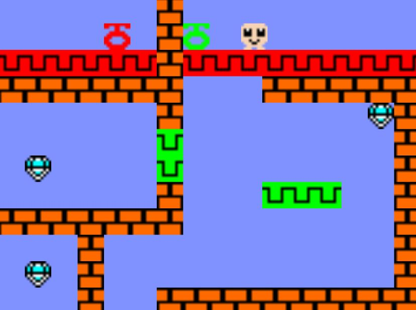

# 🎮 Dord

Dord is an original puzzle-platformer featuring 56 levels. The goal is to collect all the diamonds while avoiding things that kill you.

Some levels contain keys that unlock certain areas. But they need to be collected in a very specific sequence or else some diamonds will remain forever out of reach. If you make such an error, there is a button to restart the level.

The edges of the frame act like portals. If you leave one side you immediately reappear on the opposite one, maintaining speed and trajectory. Exploiting that mechanic is pivotal to solving the puzzles.

👉 **Play it here:**
[https://estivalet.github.io/dord/](https://estivalet.github.io/dord/) 

---

## 📌 About the Game

**Dord** is a lightweight web game focused on fun, simplicity, and fast interaction.
It runs entirely in the browser using a single HTML file, making it easy to understand, modify, and extend.

This project is perfect for:

* Learning game development fundamentals
* Exploring vanilla JavaScript techniques
* Studying simple game loops and mechanics

---

## 🚀 Features

* ⚡ Instant play (no setup required)
* 🧠 Simple and intuitive gameplay
* 🎨 Clean UI built with HTML/CSS
* 📦 Single-file architecture (`index.html`)
* 🔧 Easy to customize and expand

---

## 🛠️ Technologies Used

* **HTML5** – Structure and canvas (if used)
* **CSS3** – Styling and layout
* **JavaScript (Vanilla)** – Game logic and interactivity

---

## 📂 Project Structure

```
dord/
│── index.html   # Main game file (everything lives here)
```

---

## ▶️ How to Run Locally

1. Clone the repository:

```bash
git clone https://github.com/estivalet/dord.git
```

2. Open the project folder:

```bash
cd dord
```

3. Open `index.html` in your browser:

* Double-click it, or
* Use a local server (recommended)

---

## 💡 Customization Ideas

Want to improve the game? Try:

* Adding sound effects 🎵
* Creating levels or difficulty modes 🧩
* Improving graphics or animations 🎨
* Adding a scoring system 🏆
* Making it mobile-friendly 📱

---

## 📸 Screenshot



---

## 🤝 Contributing

Contributions are welcome!

If you’d like to improve the game:

1. Fork the repo
2. Create a new branch
3. Submit a pull request

---

## 📄 License

This project is open source and available under the **MIT License**.

